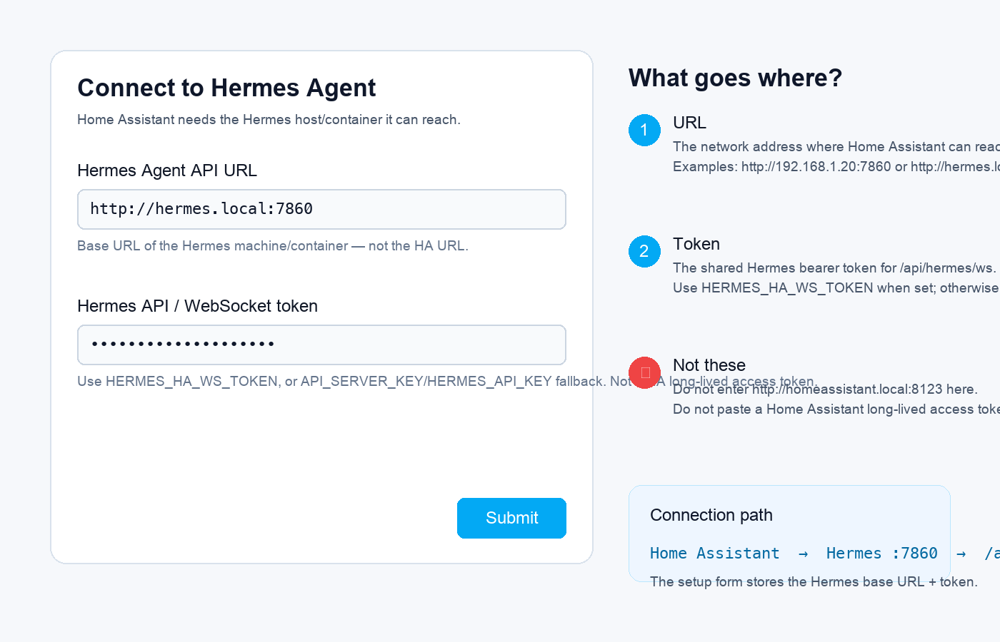
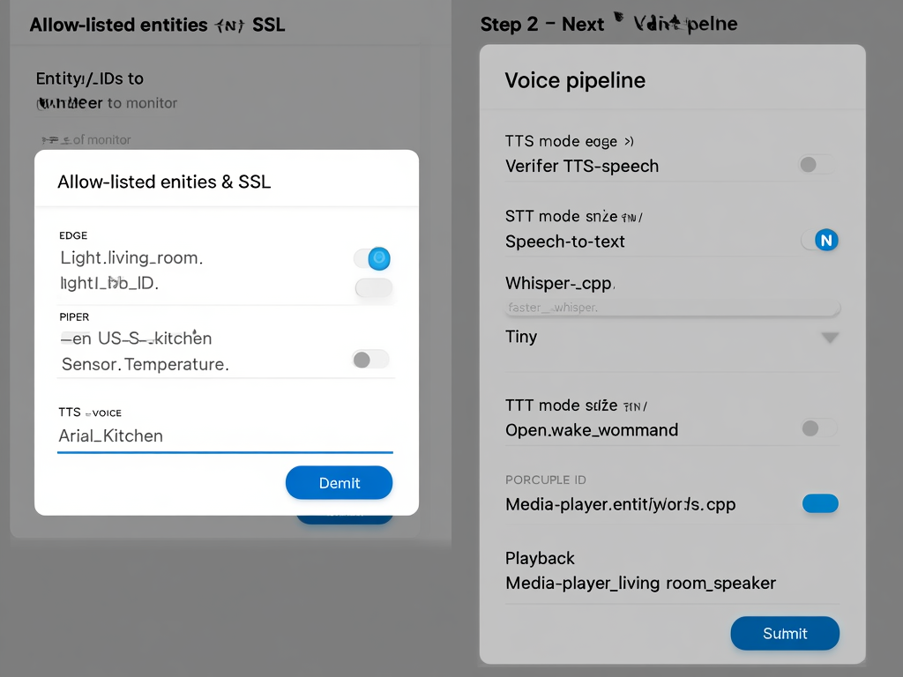

# Hermes × Home Assistant Voice Integration


Connect **Hermes Agent** to **Home Assistant** so Hermes can understand your home, call HA services, and optionally run a wake-word → STT → LLM → TTS voice loop.

This repository is a bundle of three pieces:

| Piece | Path | What it does |
|---|---|---|
| Home Assistant custom integration | `custom_components/hermes/` | Adds the `hermes` integration, HA services, status sensors, and the Lovelace action bar. |
| Hermes Home Assistant plugin | `plugins/home_assistant/` | Gives Hermes tools for entity search, state lookup, service calls, bulk control, scene/script discovery, and HA context. |
| Hermes voice-stack plugin | `plugins/voice_stack/` | Adds wake-word, speech-to-text, text-to-speech, and voice pipeline helpers. |

| Install target | Mechanism | Artifact/source | Current maturity |
|---|---|---|---|
| HA custom integration | HACS custom repository or manual copy | GitHub tag/source distribution, `custom_components/hermes/` | Supported |
| Hermes plugins | Copy into `~/.hermes/plugins` or install the Python wheel | Wheel/source distribution, `plugins/*` | Supported |
| HA add-on | Home Assistant Supervisor add-on scaffold | GitHub tag/source distribution, `addon/` | Early scaffold |

The Python wheel is intentionally plugin-focused. Use the GitHub tag or source distribution for the full HACS/custom-component/add-on bundle.

> **Release:** `v0.0.5` — ships runtime Home Assistant translations so the setup form explains exactly what the Hermes URL and token fields mean.

---

## What you get

- Ask Hermes natural-language smart-home questions: “Is the kitchen light on?”
- Let Hermes call Home Assistant services: lights, switches, scenes, scripts, climate, media players, and more.
- Use safety controls: blocked service domains, optional allow-list, and JSON-line audit logging.
- Expose Hermes health into HA as status sensors.
- Add a small Lovelace action bar to dashboards.
- Build toward local voice control with configurable STT/TTS/wake-word engines.

## Important reality check

The stack can be fully local **if you choose local engines and a local model**. The defaults are developer-friendly, not always cloud-free:

- Hermes can run local models or remote providers depending on your Hermes config.
- Edge TTS is network-backed. Use Piper for offline TTS.
- Porcupine requires a Picovoice access key. OpenWakeWord is the open-source option.
- `media_player` playback needs audio that Home Assistant can access; generated local files may require an HTTP/media bridge in more complex deployments.

---

## Architecture

```text
Voice / Chat request
        │
        ▼
Hermes Agent
  ├─ plugins/home_assistant     → HA REST/WebSocket API
  └─ plugins/voice_stack        → wake word / STT / TTS / media playback
        │
        ▼
Home Assistant
  ├─ custom_components/hermes   → config flow, services, sensors
  └─ Lovelace dashboard card    → custom:hermes-action-bar
```

### Hermes tools provided by the HA plugin

| Tool | Purpose |
|---|---|
| `ha_search_entities` | Search entities by name, domain, area-like metadata, or entity ID. |
| `ha_get_state` | Fetch current state and attributes for one entity. |
| `ha_call_service` | Call a Home Assistant service with safety checks. |
| `ha_get_overview` | Build a compact overview of the home. |
| `ha_list_services` | Discover service domains and service names. |
| `control_light_and_set_scene` | Compound helper for common light + scene actions. |
| `turn_off_all_except` | Turn off a domain while preserving chosen entities. |
| `ha_bulk_control` | Run multiple service calls and summarise results. |

### Voice tools provided by the voice plugin

| Tool | Purpose |
|---|---|
| `voice_status` | Show engine availability and pipeline state. |
| `voice_enable` | Enable continuous wake-word listening. |
| `voice_disable` | Disable continuous voice mode. |
| `voice_speak` | Speak text through the configured TTS engine. |
| `voice_listen` | One-shot record + transcription. |
| `voice_prompt` | Build the voice-optimised prompt with HA context. |

---

## Prerequisites

You need:

1. **Home Assistant** with network access from the machine running Hermes.
2. **Hermes Agent** installed and working.
3. A **Home Assistant Long-Lived Access Token** for Hermes.
4. Python 3.11+ for local development/plugin execution.
5. Optional audio dependencies if you want voice input/output on the Hermes machine.

---

## Step 1 — Install Hermes Agent

Install Hermes using the official installer:

```bash
curl -fsSL https://raw.githubusercontent.com/NousResearch/hermes-agent/main/scripts/install.sh | bash
```

Restart your shell, then verify:

```bash
hermes --version
hermes doctor
```

Run the setup wizard if this is your first Hermes install:

```bash
hermes setup
```

Choose a model/provider. For a local-first HA assistant, configure Hermes to use your local model endpoint (for example Ollama, vLLM, or llama.cpp). Remote providers also work.

---

## Step 2 — Create a Home Assistant token

1. Open Home Assistant.
2. Click your user profile/avatar.
3. Scroll to **Security**.
4. Under **Long-Lived Access Tokens**, click **Create Token**.
5. Name it something clear, for example `Hermes Agent`.
6. Copy the token now. Home Assistant only shows it once.

Keep this token private. It can control your Home Assistant instance with your account permissions.

---

## Step 3 — Install the Hermes plugins

Clone this repository:

```bash
mkdir -p ~/dev
cd ~/dev
git clone https://github.com/rusty4444/hermes-voice-ha-integration.git
cd hermes-voice-ha-integration
```

Copy the plugins into your Hermes plugin directory:

```bash
mkdir -p ~/.hermes/plugins
cp -R plugins/home_assistant ~/.hermes/plugins/home_assistant
cp -R plugins/voice_stack ~/.hermes/plugins/voice_stack
```

Configure Home Assistant connection details for Hermes. The plugin reads standard environment variables:

```bash
cat >> ~/.hermes/.env <<'EOF'
HASS_URL=http://homeassistant.local:8123
HASS_TOKEN=replace-with-your-long-lived-access-token
# Optional: require the HA custom integration to use this bearer token
HERMES_HA_WS_TOKEN=replace-with-shared-hermes-token
EOF
```

If your HA URL is different, use that instead, for example:

```bash
HASS_URL=http://192.168.1.50:8123
```

Enable the plugins in `~/.hermes/config.yaml`:

```yaml
plugins:
  enabled:
    - home_assistant
    - voice_stack
```

If your config already has a `plugins.enabled` list, add the two entries instead of replacing the whole section.

Restart Hermes after changing plugins or `.env`.

The `voice_stack` plugin starts a small HA-facing WebSocket receiver at:

```text
ws://<hermes-host>:7860/api/hermes/ws
```

Home Assistant connects to this endpoint through the **Hermes URL** you enter below. If `HERMES_HA_WS_TOKEN`, `API_SERVER_KEY`, or `HERMES_API_KEY` is set, the HA custom integration token must match it.


---

## Step 4 — Test Hermes ↔ Home Assistant before installing anything in HA

Start Hermes:

```bash
hermes
```

Ask:

```text
Search my Home Assistant lights.
```

Then try a read-only state check:

```text
Is the living room light on?
```

Expected result:

- Hermes should use `ha_search_entities` or `ha_get_state`.
- The response should include the current state from Home Assistant.
- If Home Assistant is unreachable, Hermes should say that it cannot reach HA rather than crashing.

If this fails, skip ahead to [Troubleshooting](#troubleshooting) before enabling write actions.

---

## Step 5 — Install the Home Assistant custom integration

### Option A — HACS custom repository

1. In Home Assistant, open **HACS**.
2. Open the three-dot menu → **Custom repositories**.
3. Add this repository URL:

   ```text
   https://github.com/rusty4444/hermes-voice-ha-integration
   ```

4. Choose category **Integration**.
5. Install **Hermes Voice Assistant**.
6. Restart Home Assistant.

### Option B — Manual install

From this repo checkout, copy the custom component into HA's config directory:

```bash
cp -R custom_components/hermes /config/custom_components/hermes
```

If you are copying over SSH/Samba from another machine, the target is the Home Assistant config directory:

```text
/config/custom_components/hermes
```

Restart Home Assistant after copying.

---

## Step 6 — Add the integration in Home Assistant

1. Open **Settings → Devices & services**.
2. Click **Add integration**.
3. Search for **Hermes Voice Assistant**.
4. Complete the setup form:



| Setup field | What it means | Example |
|---|---|---|
| **Hermes Agent API URL** | The base URL of the machine or container running Hermes Agent's HA-facing API/WebSocket receiver. This must be reachable from Home Assistant. It is **not** your Home Assistant URL. | `http://192.168.1.20:7860` or `http://hermes.local:7860` |
| **Hermes API / WebSocket token** | The bearer token expected by Hermes for the HA WebSocket/API receiver. Use `HERMES_HA_WS_TOKEN` if you set it; otherwise use the fallback token configured as `API_SERVER_KEY` or `HERMES_API_KEY`. This is **not** a Home Assistant long-lived access token. | the same shared Hermes token from `~/.hermes/.env` |

Visual check:

```text
Home Assistant  →  http://<hermes-host>:7860  →  /api/hermes/ws
```

Do **not** enter `http://homeassistant.local:8123` in the Hermes URL field. That URL is only used by Hermes itself when Hermes talks back to Home Assistant via `HASS_URL`.

5. Submit.

The integration adds:

- `hermes.hermes_command` service for HA-native service dispatch.
- `hermes.voice_settings` service for voice/dashboard helpers.
- Hermes status entities:
  - `sensor.hermes_gateway_status` — Hermes gateway reachable or offline
  - `sensor.hermes_uptime_hours` — how long Hermes has been running
  - `sensor.hermes_total_interactions` — number of voice interactions
  - `sensor.hermes_total_errors` — number of voice errors
  - `sensor.ha_ws_connection` — HA WebSocket connection state
  - `sensor.hermes_voice_ready` — voice pipeline ready flag
  - `sensor.hermes_tts_voice` — configured default TTS voice
  - `sensor.hermes_stt_engine` — configured STT engine
  - `sensor.hermes_wake_word` — configured wake-word keyword(s)
  - `sensor.hermes_media_player` — configured media player for TTS

---

## Step 7 — Configure the voice pipeline via the HA options UI

After adding the integration, open **Settings → Devices &amp; services → Hermes Voice Assistant → Options**.

The options flow has two pages.

### Page 1 — Allow-listed entities &amp; SSL

| Field | What to enter |
|---|---|
| **Entity IDs to monitor** | One entity per line or comma-separated (empty = all entities) |
| **Verify SSL certificates** | Toggle off if your Hermes endpoint uses a self-signed cert |

### Page 2 — Voice pipeline



*Mockup of the **Step 2 — Voice pipeline** options page. The **Step 1 — Allow-listed entities & SSL** page appears first, with an entity-ID editor and an SSL toggle.*

| Field | What to enter |
|---|---|
| **TTS engine** | `edge` (default, network), `piper` (local), `elevenlabs`, or `openai` |
| **Default TTS voice / voice-ID** | Voice name or ID for the chosen TTS engine (e.g. `en-US-AriaNeural` for Edge TTS) |
| **STT engine** | `faster-whisper` (default, local) or `whisper-cpp` |
| **STT model size** | Model size for the chosen STT engine: `tiny`, `base`, `small`, `medium`, `large` |
| **Wake-word engine** | `porcupine` (default), `openwakeword`, or `command` |
| **Wake-word keyword(s)** | One keyword per line or comma-separated (e.g. `hey jarvis`, `computer`) |
| **Media player entity ID** | HA `media_player.*` entity used for TTS playback (e.g. `media_player.living_room_speaker`) |

Values are persisted in the config entry options. After saving, Hermes reads them from `entry.options` on every restart. Screenshots of the live UI are welcome via PR.

---

## Step 8 — Add the Lovelace action bar

Add this card to a dashboard:

```yaml
type: custom:hermes-action-bar
title: Hermes Voice
show_status: true
```

If the browser shows “Custom element doesn’t exist”, hard refresh the dashboard and confirm `/hermes_static/hermes_action_bar.js` is registered by the integration/HACS install.

---

## Step 9 — Configure safety controls

The plugin blocks dangerous service domains by default, including:

- `shell_command`
- `command_line`
- `python_script`
- `pyscript`
- `hassio`
- `rest_command`

For extra safety, create an allow-list at:

```text
~/.hermes/ha_allow_list.json
```

Example:

```json
{
  "enabled": true,
  "rules": [
    {"entity_id": "light.*", "services": ["turn_on", "turn_off", "toggle"]},
    {"entity_id": "scene.*", "services": ["turn_on"]},
    {"entity_id": "media_player.living_room", "services": ["play_media", "volume_set"]}
  ]
}
```

When enabled, service calls not matching the allow-list are denied.

Audit logs are written as JSON lines to:

```text
~/.hermes/ha_audit.log
```

---

## Step 10 — Optional: fine-tune voice engines outside HA

Install optional voice dependencies in the Python environment that runs Hermes.

### TTS options

#### Edge TTS (easy, network-backed)

```bash
pip install edge-tts
```

Configure:

```bash
cat >> ~/.hermes/.env <<'EOF'
HERMES_TTS_ENGINE=edge
HERMES_TTS_VOICE=en-US-AriaNeural
EOF
```

#### Piper TTS (offline)

```bash
pip install piper-tts
```

Download a Piper voice model from:

```text
https://huggingface.co/rhasspy/piper-voices
```

Configure:

```bash
cat >> ~/.hermes/.env <<'EOF'
HERMES_TTS_ENGINE=piper
HERMES_TTS_VOICE=en_US-lessac-medium
EOF
```

### STT options

#### faster-whisper

```bash
pip install faster-whisper sounddevice numpy
```

Configure:

```bash
cat >> ~/.hermes/.env <<'EOF'
HERMES_STT_ENGINE=faster-whisper
HERMES_STT_MODEL=tiny
EOF
```

### Wake-word options

#### Porcupine

```bash
pip install pvporcupine pyaudio
```

Create a Picovoice key, then add:

```bash
cat >> ~/.hermes/.env <<'EOF'
HERMES_WAKE_WORD_ENGINE=porcupine
HERMES_WAKE_WORD=computer
PORCUPINE_ACCESS_KEY=replace-with-picovoice-key
EOF
```

#### OpenWakeWord

```bash
pip install openwakeword pyaudio numpy
```

Configure:

```bash
cat >> ~/.hermes/.env <<'EOF'
HERMES_WAKE_WORD_ENGINE=openwakeword
EOF
```

### Media player output

To route spoken responses through Home Assistant:

```bash
cat >> ~/.hermes/.env <<'EOF'
HERMES_MEDIA_PLAYER=media_player.living_room
EOF
```

> Note: `media_player.play_media` needs a URL/path Home Assistant and the target player can access. Local `file://` paths from the Hermes machine are not always playable by HA media players.

---

## Step 11 — Optional Home Assistant add-on

This repository includes an early HA add-on scaffold in `addon/`. Use it if you want Hermes voice services to run under Home Assistant Supervisor instead of a separate machine.

High-level flow:

1. Add this repository as an add-on repository in **Settings → Add-ons → Add-on Store → Repositories**.
2. Install **Hermes Voice Assistant**.
3. Configure model/STT/TTS/wake-word settings in the add-on options.
4. Start the add-on.
5. Open the add-on logs and confirm Hermes starts cleanly.

The add-on is intentionally marked `boot: manual` in `v0.0.5`. Start it manually first, verify logs, then decide whether to change boot behaviour later.

---

## Verification checklist

### Read-only test

Ask Hermes:

```text
What Home Assistant entities can you see?
```

Expected: a grouped summary or list of entities.

### State test

Ask:

```text
Is the kitchen light on?
```

Expected: current state and attributes from HA.

### Safe service-call test

Ask:

```text
Turn on the kitchen light.
```

Expected:

- Hermes calls `ha_call_service`.
- The HA light changes state.
- An audit-log entry is written if auditing is enabled.

### Home Assistant service test

In **Developer Tools → Services**, call:

```yaml
service: hermes.hermes_command
data:
  domain: light
  service: turn_on
  entity_id: light.kitchen
```

Expected: HA dispatches `light.turn_on`.

### Voice status test

Ask Hermes:

```text
Show voice status.
```

Expected: installed/uninstalled status for configured STT, TTS, wake-word engines.

---

## Development setup

```bash
cd ~/dev/hermes-voice-ha-integration
python3 -m venv .venv
source .venv/bin/activate
pip install -e '.[dev]'
python -m pytest tests/ -q
```

Run static compilation:

```bash
python -m compileall -q custom_components plugins tests
```

Build package metadata:

```bash
python -m build --sdist --wheel
```

Run release integrity checks:

```bash
python scripts/check_release_integrity.py
```

See [`docs/release.md`](docs/release.md) for the full release checklist and artifact semantics.

The tests are mocked and do not require a live Home Assistant instance.

---

## Troubleshooting

### Hermes cannot see Home Assistant

Check:

```bash
grep -E '^HASS_URL=|^HASS_TOKEN=' ~/.hermes/.env
curl -H "Authorization: Bearer $HASS_TOKEN" "$HASS_URL/api/"
```

A healthy HA API response looks like:

```json
{"message":"API running."}
```

### Hermes says Home Assistant is unavailable

Common causes:

- Wrong `HASS_URL`.
- Token copied incorrectly.
- Home Assistant is using HTTPS with a certificate your machine does not trust.
- Docker/add-on networking cannot resolve `homeassistant.local`.

Try an IP address first:

```bash
HASS_URL=http://192.168.1.50:8123
```

### The Lovelace card does not load

- Restart Home Assistant after installing the integration.
- Clear browser cache or hard refresh.
- Confirm `hacs.json` is at the repository root if using HACS.
- Confirm the resource URL is `/hermes_static/hermes_action_bar.js`.

### Voice commands transcribe but do not play audio

- Confirm `HERMES_MEDIA_PLAYER` is a real `media_player.*` entity.
- Confirm the player supports `play_media`.
- If running Hermes outside HA, ensure HA can access generated audio. This may need an HTTP-accessible media bridge.

### Service call denied

Check:

- The domain is not in the built-in blocked-domain list.
- Your allow-list includes the target entity and service.
- `~/.hermes/ha_audit.log` for the denial reason.

---

## Known limitations in `v0.0.5`

- The voice stack is usable as engine wrappers and Hermes tools, but room-grade voice satellite UX still needs more work.
- TTS audio delivery to HA media players may need an HTTP/media bridge depending on deployment topology.
- The add-on scaffold may need environment-specific build adjustments before it is suitable as the primary install path for every HA setup.
- The Lovelace action bar is intentionally minimal.
- The HA custom integration and Hermes plugins are released together in one repo for now; future releases may split packaging by install target.


---

## Repository layout

```text
custom_components/hermes/      Home Assistant custom integration
plugins/home_assistant/        Hermes plugin for HA tools and context
plugins/voice_stack/           Hermes plugin for voice pipeline tools
skills/homescript/             Homescript skill for smart-home commands
addon/                         Home Assistant add-on scaffold
tests/                         Mocked unit tests
```

---

## Licence

MIT — see [`LICENSE`](LICENSE).
